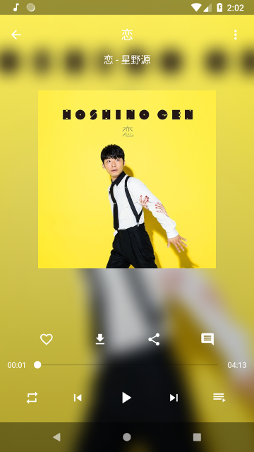
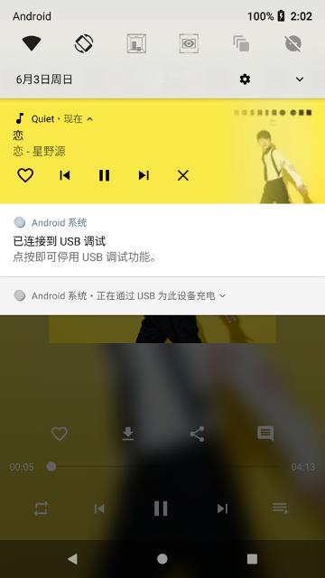
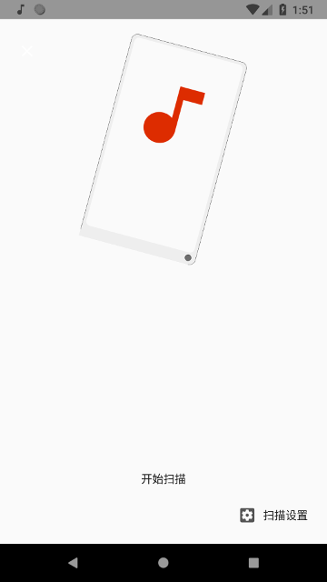
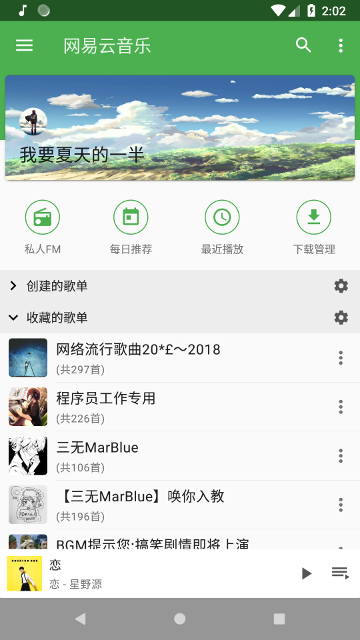
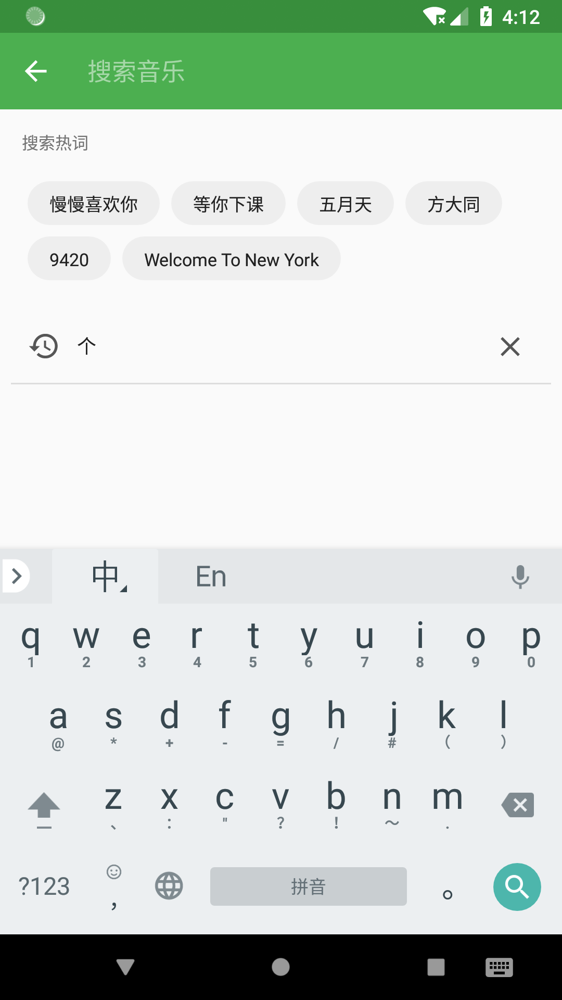
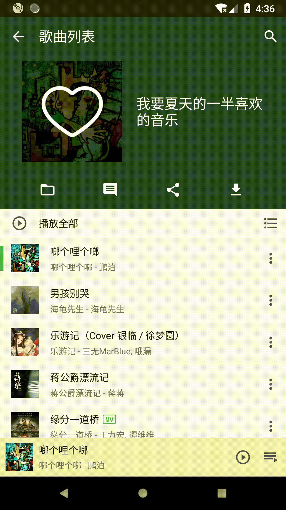

# Quiet 
A simple MusicPlayer.

__

Kotlin + 模块化 + 协程

## OverView

### player
|                 normal                  |               fm                |               notfication                |
| :-------------------------------------: | :-----------------------------: | :--------------------------------------: |
|  |  |  |

### Local

|                main                |                albums                 |                 scanner                  |
| :--------------------------------: | :-----------------------------------: | :--------------------------------------: |
|  |  |  |

### Netease 

| Login                                  | Main                                 |
| -------------------------------------- | ------------------------------------ |
|  |  |

### Search Module
|                 main                  |            opration             |
| :-----------------------------------: | :-----------------------------: |
|  |  |

### PlaylistDetail Module
|               main                |               filter                |
| :-------------------------------: | :---------------------------------: |
|  |  |

##  About

only for study , non-commercial use.

 Thanks!

## License

Apache License Version 2.0

